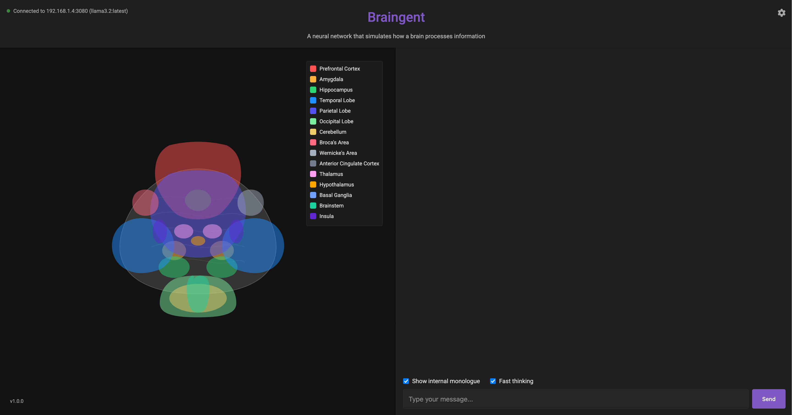

# Braingent

Long time nerd, first public repo!

Braingent (Brain agent) is an agentic neural network simulation that models how different regions of the human brain process information, powered by Ollama language models. Braingent routes user queries to relevant brain regions, simulates internal processing, and provides responses that mimic human cognitive processes.

## ⚠️ Important: Ollama Required

**Braingent requires an Ollama server to function.** Before using, click the gear icon (⚙️) in the top right corner to configure your Ollama connection.

## Ollama Setup

1. **Install Ollama**: If you haven't already, [install Ollama](https://ollama.ai/download) on your system or a server
2. **Start Ollama**: Make sure the Ollama server is running
3. **Connect Braingent to Ollama**:
   - Click the gear icon (⚙️) in the Braingent interface
   - Enter your Ollama server IP address (e.g., 127.0.0.1 or X.X.X.X)
   - Enter the port (default: 11434)
   - Click "Test Connection" to verify
   - Select your preferred model from the dropdown
   - Click "Save Settings"

## Features

- **Brain Region Simulation**: Simulates 15 different brain regions including Prefrontal Cortex, Amygdala, Hippocampus, and more
- **Visual Brain Model**: Interactive visualization showing which regions are active during processing
- **Real-time Processing**: Watch as thoughts are processed through different regions of the simulated brain
- **Internal Monologue**: Option to view the internal "thoughts" of each brain region
- **Fast Thinking Mode**: Accelerated processing for quicker responses
- **Customizable Ollama Integration**: Connect to your own Ollama instance with model selection

## Installation

1. Clone the repository:
    git clone https://github.com/yourusername/braingent.git
    cd braingent

2. Install the required dependencies:
    pip install -r requirements.txt

3. Run the application:
    python main.py

4. Open your browser and navigate to:
    http://localhost:5000 (or the IP:PORT you set in main.py flask app)

5. **Configure Ollama**: Click the gear icon and enter your Ollama server details

## How It Works

Braingent simulates the distributed processing of the human brain by:

1. Routing input to relevant brain regions based on content
2. Processing the input through each activated region in parallel using Ollama language models
3. Integrating regional processing through the Prefrontal Cortex
4. Generating responses that reflect the combined insights of all regions

## Technologies Used

- Python with Flask for backend
- Socket.IO for real-time communication
- SVG for brain visualization
- HTML/CSS/JavaScript for frontend
- Ollama API for language model integration

## Recommended Ollama Models

For best results, I recommend using these models with Braingent:
- deepseek-r1
- llama3
- mistral
- neural-chat

## Future Ideas
- Implement memory / RAG function using the "memory" part of the brain
- Time based correlation with memory based on the Chat
- TTS
- STT

## License

MIT License